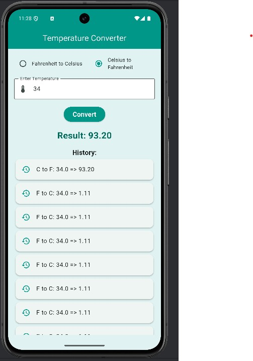
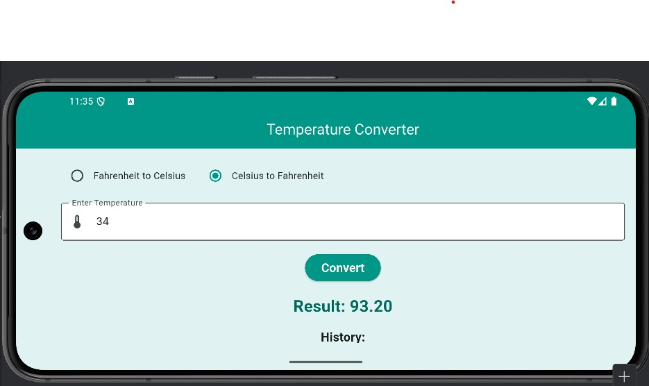

# Temperature Converter App

A simple and elegant Flutter app that converts temperatures between Fahrenheit and Celsius. Designed with responsive layout, smooth animations, and a clean UI using Flutter's Material design system.

## Features

- Convert temperatures between **Fahrenheit** and **Celsius**
- Input validation for accurate conversions
- Animated result display using `ScaleTransition`
- Scrollable **conversion history**
- Supports both **portrait** and **landscape** orientations
- Beautiful theming with `ColorScheme` and custom styling

## Tech Stack

- **Flutter** (Dart)
- **Material Design**
- `AnimationController` & `CurvedAnimation`
- `TextField`, `ElevatedButton`, `Radio`, `ListView`, and more

## Screenshots

## Getting Started

### Prerequisites
- Flutter SDK installed
- Compatible IDE (e.g., Android Studio, VS Code)

### Installation & Run

1. Clone the repository:
   git clone https://github.com/Mathias-Kabango3/flutterProjectOne/
   cd temp-converter-flutter
2. Install dependencies and run the app:
   flutter pub get
   flutter run
